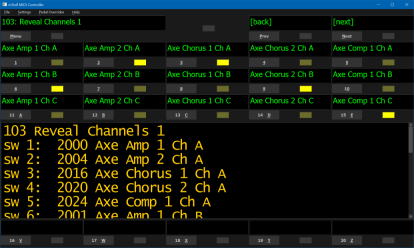

## mTroll Hybrid MIDI Controller

mTroll is the software portion of a hybrid hardware/software MIDI foot controller. mTroll is the MIDI control engine that I use with my [monome-based]( https://web.archive.org/web/20071011033743/http://monome.org/40h/kit ) foot controller. mTroll outputs MIDI in response to input from the monome or the gui. mTroll can be used standalone without hardware as a virtual foot controller. mTroll has native support for Axe-Fx processors with round tripping of effect block bypass and channel states, scene control and looper block control.

[Original Project Homepage](http://www.creepingfog.com/mTroll/)

## Software Feature Overview
  
[(click to enlarge)](docs/images/mtroll.png)  

Patches
- Unlimited patch count  
- Patches can send multiple MIDI messages of any length  
- Patches support Normal, Toggle, Momentary, Sequence or patchListSequence modes  
- Normal mode sends one of set MIDI messages when switch pressed, and a different set when another Normal mode patch is selected  
- Toggle mode sends one set of MIDI messages when switch pressed, and a different set when pressed again  
- Momentary mode sends one set of MIDI messages when switch pressed, and a different set when released  
- Sequence mode increments through a list of messages to send when a switch is pressed repeatedly (a toggle with more than 2 sets/states) ([Dr. Z](http://tech.groups.yahoo.com/group/eventidehelps/message/167) )  
- patchListSequence mode increments through a list of other patches when a switch is pressed repeatedly  
- Patch state is retained across bank loads  
- [Meta-patch](docs/docs.md#metaPatches) for resetting all patches loaded in a bank  
- [Meta-patch](docs/docs.md#metaPatches) for loading another bank  
- [Native support](docs/axe.html) for [Axe-Fx processors](http://www.fractalaudio.com/products-fa-axefx.html) (when used with MIDI In)  

Banks (Pages)
- Banks are basically the same as pages as implemented in full-featured MIDI foot controllers that started being produced after 2010 (i.e., every bank is an explicitly defined page)
- Unlimited bank count  
- Banks are simply mappings of patches to switches (physical or virtual)  
- Banks can address more switches than are physically present on input hardware  
- A single patch can be used in multiple banks or on multiple switches in the same bank  
- Multiple patches can be assigned to a single switch in any given bank (the first patch assigned to a switch in a bank owns the expression pedals, switch label and indicator)  
- Banks can be configured with load and unload patch states (optionally activate or deactivate particular patches at bank load or unload)  
- Support for default mappings (for [instant access switch](docs/docs.md#instantAccess) creation)  
- Support for defining [exclusive switch groups](docs/docs.md#exclusiveGroup) per bank (for radio button functionality)  

Expression Pedals
- Support for four expression pedals  
- Each pedal can be configured globally and/or locally per patch  
- Supports minimum and maximum transmission values, value inversion and manual pedal calibration  
- Each pedal can be configured for one or two controllers (per pedal, up to 2 globals and 2 per patch locals)  
- Only one patch at a time has control of the pedals (in addition to the global control which can be disabled per patch)  
- Support for [manual calibration](docs/docs.md#exprPedalCal)  
- Support for [virtual toggle footswitches](docs/docs.md#virtualToggles) at toe and/or heel positions  
- Support for [multiple sweep response curves](docs/docs.md#curves)  

Configuration
- Patch and bank settings are stored in plain text XML file ([example](data/testdata.config.xml))  
- UI is configured via an independent plain text XML file ([example](data/testdata.ui.xml))  
- Same data file can be used with different UI files for display on different resolutions or form factors  

Other
- Can be used without input hardware (using computer keyboard, and on-screen buttons and indicators)  
- Support for multiple MIDI out devices (one MIDI out assignment per patch)  
- Supports independent labels for each switch/button ([Dr. Z](http://tech.groups.yahoo.com/group/eventidehelps/message/167) )  
- Supports secondary functions per switch via long-press  
- User-definable LED colors

## Download

### application software
[Latest mTroll](docs/changelog.md) Win32 application installer is available on the [releases page](../../releases/).

[Usage notes here](docs/docs.md).

To use with a monome board, you must install the [FTDI D2XXX drivers](http://www.ftdichip.com/Drivers/D2XX.htm) (not necessary for operation without a controller).

## Developer Notes

The core of the app is written in cross-platform C++. The GUI and hardware device support (MIDI out and monome) were originally implemented for Win32 (using WTL for the GUI). It has since been ported to [Qt 5.15](http://qt-project.org/downloads#qt-lib). The MIDI In/Out device support is only implemented for Win32 at this time.  

The GUI and hardware are accessed from the core through core-defined interfaces, so a Mac or Linux developer will be able to "fill in the blanks" using whatever native OS APIs are available without having to modify the core.  

The application uses [TinyXML](http://sourceforge.net/projects/tinyxml/) for parsing of the XML data files (licensed under the [zlib/libpng License](http://www.opensource.org/licenses/zlib-license.php)). (TinyXML was being used in the WTL version of the app, before the Qt port.)  

The monome uses a simple [serial protocol](https://web.archive.org/web/20071013125521/http://wiki.monome.org/view/SerialProtocol) over USB (by way of an FTDI serial to USB module). The application communicates with the monome using the [FTDI D2XXX API](http://www.ftdichip.com/Support/Documents/ProgramGuides/D2XX_Programmer%27s_Guide(FT_000071).pdf).  

The repository includes the modified monome firmware and TinyXML source.  

Source directory hierarchy:
<dl>
<dt>./Engine</dt>
<dd>Cross-platform interfaces, engine control logic, data file loaders, and patch and bank implementations</dd>
<dt>./midi</dt>
<dd>MIDI implementation (Win32 only at this time)</dd>
<dt>./mTrollQt</dt>
<dd>Qt application and interface implementations</dd>
<dt>./Monome40h</dt>
<dd>FTDI and monome interfaces, and monome serial protocol helpers  
<dt>./Monome40h/qt</dt>
<dd>monome interface implementation in Qt</dd>
<dt>./setup</dt>
<dd>project for building Win32 installer using Inno Setup (https://jrsoftware.org/isinfo.php)</dd>
<dt>./tinyxml</dt>
<dd>TinyXML source (http://tinyxml.sourceforge.net/)</dd>
</dl>
