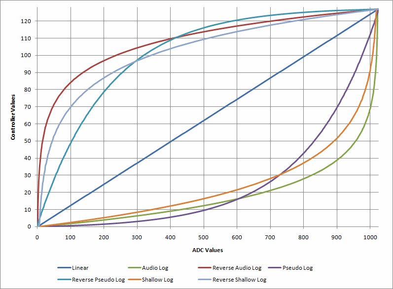

# mTroll MIDI controller software usage / notes

## Overview

The first three sections below describe the software UI and engine modes/commands. The rest of this document describes features of the software that are tied to the XML data files (which are [semi-documented here](xmlDataFiles.html)).

Contents  
- [User Interface](#ui)  
- [Keybindings](#keybindings)  
- [Engine Control Modes and Commands](#modes)  
- Patch Topics  
	- [Patches](#patches)  
	- [Patch Commands](#patchCommands)  
	- [Meta-Patches](#metaPatches)  
- Bank and Switch Topics  
	- [Banks](#banks)  
	- [Switches](#patchmaps) (formerly PatchMaps)  
	- [Instant Access Switch Support](#instantAccess)  
	- [Exclusive Switch Groups](#exclusiveGroup)  
- Expression Pedal Topics  
	- [Expression Pedal Odds and Ends](#exprPedals)  
	- [Expression Pedal Response Curves](#curves)  
	- [Expression Pedal Virtual Toggle Switches](#virtualToggles)  
	- [Expression Pedal Calibration](#exprPedalCal)  

## User Interface  

**Main Display Window** displays text that is dependent upon the active mode and the function of the switch pressed  
**Trace Window** displays diagnostic messages  
**Switch Labels** display patch names or button descriptions  
**Switch Indicators** show whether a patch is active or inactive (which is patch mode dependent)  
**Switch Buttons** are used in addition to or in place of dedicated hardware switches. Underlined letters in button text show what keyboard letters can be used to activate the button. Pressing a letter causes a button down in addition to a button release. For best results with momentary patches, place focus on the button and use the spacebar (button release does not happen until the spacebar is released).  

## Keybindings and Other Misc  

The application is not an editor (it only reads the XML files, does not generate them). Version 2.5.1 of [Raymond, the PMC10 editor,](http://www.creepingfog.com/sean/pmc/download.html) can be used to generate config.xml files using the Export to XML command.  

The current version loads a pair of files, testdata.config.xml (the patches and banks) and testdata.ui.xml (the GUI definitions) automatically at startup (it looks in the startup directory). Press Ctrl+O to load a different set (the last opened set of files is remembered across restarts).  

Press F5 to reload the both the UI and config files.  
Press Ctrl+T to toggle the visibility of the trace window and resize the main display.  
Press Ctrl+R to re-establish communication with the monome board.  

  
## Engine Control Modes and Commands

The app supports up to a total of 64 switches split between preset switches and operating switches that are mode dependent. The function of each operating switch is dependent upon the control mode that is active. The Menu button/switch is used to choose a new operating mode (or escape out of a non-default mode). The `switches` block of the config.xml file allows you to define what modes are assigned to each switch. The only required assignments are for `menu` (formerly mode), `increment` and `decrement`. See the [Axe-Fx data file](downloads/axefx.config.xml) for example menu/switch assignments.  

**Bank mode** (this is the default power up mode)  
Preset switches activate patches  
Menu switch label displays the active bank number and name  
Menu switch changes to Menu mode  
Main Display Window displays patch name and number when a preset switch is pressed  
This is the only mode or command that can not be assigned a switch in Menu mode  

**Menu mode** (formerly Mode select)  
All switches in this mode are customizable (there are defaults that can be overridden in the `switches` block). Some defaults are described here.  
Preset switches select one of the following described modes (or executes a described command)  
Next and Previous cause a transition to Bank Navigation mode, displaying the next or previous bank  
Menu switch escapes back to the default mode (with the bank that was previously active)  
Switches can also be assigned to immediately load specific banks (reducing need for `LoadBank` metapatch; see [example](downloads/axefx.config.xml))  
Main Display Window displays mode name  

**Bank Navigation mode**  
Any preset switch will load the currently displayed bank (commits the bank) and changes mode back to the default  
Next and Previous increment and decrement the displayed bank  
Menu switch escapes back to the default mode (with the bank that was previously active)  
Main Display Window displays bank information when the displayed bank changes  

**Bank Description mode**  
Preset switches display patch state information in the main display window  
Next and Previous increment and decrement the displayed bank  
Menu switch escapes back to the default mode (with the bank that was previously active)  

**Manual Program Change mode**  
This allows interactive program changes; created out of a desire to interactively send arbitrary program changes without creating patches, banks and patch mappings.  
First 10 preset switches allow a channel, bank or program to be typed in  
11th switch sets the channel for subsequent messages to the number typed so far (enter the number, then press `Set channel`)  
12th switch sends a bank select (enter the number, then press `Send bank select`)  
13th switch sends a program change (enter the number, then press `Send program change`)  
14th switch decrements the number in the buffer and sends the program change  
15th switch increments the number in the buffer and sends the program change  
Next switch clears the typing buffer  
Previous switch functions as backspace  
Menu switch escapes back to the default mode (with the bank that was previously active)  
Main Display Window displays typed numbers and sent messages (if the entered channel corresponds to an Axe-Fx `device`, then the name of the Axe-Fx program will appear in the display if sync is enabled)  

**Manual Control Change mode**  
This allows interactive control changes.  
First 10 preset switches allow a channel, bank, controller or control value to be typed in  
11th switch sets the channel for subsequent messages to the number typed so far (enter the number, then press `Set channel`)  
12th switch sets the controller number (enter the number, then press `Set controller`)  
13th switch sends a control change (enter the value number, then press `Send control change`)  
14th switch decrements the cc value number in the buffer and sends the control change  
15th switch increments the cc value number in the buffer and sends the control change  
Next switch clears the typing buffer  
Previous switch functions as backspace  
Menu switch escapes back to the default mode (with the bank that was previously active)  
Main Display Window displays typed numbers and sent messages  

**Bank Direct mode**  
First 10 preset switches allow a bank number to be typed in  
Next switch functions as commit/enter: loads the bank number entered and switches the mode back to the default  
Previous switch functions as backspace  
Menu switch escapes back to the default mode (with the bank that was previously active)  
Main Display Window displays bank number (and name if applicable) of number typed  

**Time Display mode**  
Displays current time and date in the main window.  
Displays time elapsed since load of the current configuration files.  
Press of any switch escapes back to default mode (with the bank that was previously active).  

**Raw ADC Value mode**  
Preset switches select ADC port to track  
Menu switch escapes back to the default mode (with the bank that was previously active)  
Main Display Window displays ADC value of selected port as you move the connected expression pedal  

**ADC override mode**  
This mode is an extension to the Pedal Overrides menu command in the GUI  
It makes it possible to modify ADC overrides from the hardware  

**Recall Bank command**
**Backward command**
**Forward command**
These three items were originally [meta-patches](#metaPatches) (and they still are), but they make much more sense as a mode commands. Backward and forward operate like the history function of a web browser. The Backward and Forward commands operate instantly (no confirmation switch press is required). Recall causes the controller to switch back and forth between the currently loaded bank and the previously loaded one; it is similar to 'channel recall' on TV remote controls. It can be invoked repeatedly to switch back and forth between two banks. (Recall is basically an automatic application of Backward and Forward.)  

**Test LEDs command**  
This is a command that is available in the Menu  
The test happens automatically during hardware handshake, but this command allows you to execute it on demand  

**Toggle LED inversion command**  
This is a command that is available in the Menu  
It makes it possible to override the LED inversion state that is set in the loaded config data file  

**Toggle display of trace window command**  
This is a command that is available in the Menu  
Executes the [CTRL+T](#keybindings) command from the hardware to toggle the display of the trace window in the GUI  

## Patches  

A `patch` is simply a collection of commands that is identified by a name and number. It has a type that defines when the commands are executed.  

Patches can be defined to be `Toggle`, `Momentary`, `Normal`, `AxeToggle`, `AxeMomentary`, `AxeFxTapTempo`, `Sequence`, `patchListSequence`, `compositeToggle` or `persistentPedalOverride`. Except for sequence patches, patches can have commands that are assigned to one of two groups: `"A"` and `"B"`. `Toggle` patches operate by sending the group `A` commands on one press of a switch, and sending the group `B` commands on a second press of the switch. `Momentary` patches operate by sending the group `A` commands on the press of the switch, and sending the group `B` commands on the release of the switch. `Normal` patches operate by sending the group `A` commands on the press of the switch and sending the group `B` commands when another `Normal` patch is activated. Pressing the switch for a `Normal` patch two times in a row results in the group `A` commands being exectuted, followed by the group `B` commands and then the group `A` commands again.  

`persistentPedalOverride` is a toggle patch used to reassign expression pedals such that the reassignment sticks until the patch is toggled off or until another `persistentPedalOverride` patch is activated. It overrides pedal assignments made in subsequently activated patches that are not of type `persistentPedalOverride`.  

`AxeToggle` and `AxeMomentary` patches work the same as `Toggle` and `Momentary` except that they do an Axe-Fx sync after the command has been invoked. See the [Axe-Fx page](axe.html) for more info.  

`AxeFxTapTempo` is the same as `Momentary` except that the switch LED blinks in response to the real-time tempo sysex message sent by an Axe-Fx (if a) the MIDI Out is connected to the MIDI In of mTroll and b) the Axe-Fx is configured to send real-time tempo sysex messages).  

`Sequence` patches execute a command for each press of a switch.  

`patchListSequence` is similar to the `sequence` patch type but references other patches instead of patch commands. It makes it possible to step through a list of patches by pressing the same switch repeatedly. At the end of the list, the sequence repeats.  
example 1: a switch that on press 1 turns on tuner, on press 2 turns off tuner and executes the `back` command.  
example 2: a switch that on press 1 assigns an expression pedal to a cc, on press 2 assigns to a different cc, on press 3 assigns to another cc, etc.  

`patchListSequence` sample definition (patches 401-403 are not shown):  

    <patch type="patchListSequence" name="Pedal List" number="400">  
    <patchListItem>401</patchListItem>  
    <patchListItem>402</patchListItem>  
    <patchListItem>403</patchListItem>  
    </patch>

`compositeToggle` sample definition that executes the B commands from some patches on first press, and the A commands on some patches on second press (patches 401-405 are not shown):  

    <patch type="compositeToggle" name="A Composite Toggle Patch" number="406">  
    <refPatch group="A" refGroup="B">401</refPatch>  
    <refPatch group="A" refGroup="B">402</refPatch>  
    <refPatch group="A">404</refPatch>  <!-- Group A of patch 404 will be executed on first press of switch assigned to patch 406 -->
    <refPatch group="B" refGroup="A">402</refPatch>  
    <refPatch group="B" refGroup="A">403</refPatch>  
    <refPatch group="B">405</refPatch>  <!-- Group B of patch 405 will be executed on second press of switch assigned to patch 406 -->  
    </patch>

`Patch`es support an optional `channel` (or `device`) attribute that is used as the default `channel`/`device` for `patchCommand`s in the `patch`. Even if a `channel`/`device` is specified, `patchCommand`s can specify their own.  

## Patch Commands  

Patches are composed of one or more commands (in one or two groups "`A`" or "`B`", with "`A`" being the default if `group` is unspecified).  

The `midiByteString` command is used to specify, in hex, a single, or multiple, MIDI commands to send.  

The `ProgramChange`, `ControlChange`, `NoteOn` and `NoteOff` commands are simpler to use than `midiByteString`s for those MIDI messages. These commands support a `channel` (or `device`) attribute. If no `channel` or `device` attribute is specified, then mTroll looks for a `channel` or `device` attribute on the `Patch` that contains the command.  

The `RefirePedal` command can be used to resend the current value of an expression pedal. This is useful if you have left an expression pedal at some random value and want to use a patch to toggle between a pre-determined value and that random value.  

The `Sleep` command can be used to pause a command sequence for an amount of time specified in milliseconds. Note that the actual amount of time paused will not exactly match the time specified since the OS is not a real-time system, but it will be close enough that variances shouldn't matter. The Sleep command pauses everything in mTroll: MIDI output, MIDI input and the UI. Example of a 5 second sleep: `<Sleep group="A">5000</Sleep>`  

The `AxeProgramChange` command is an Axe-Fx specific version of the generic `ProgramChange` command. When you use this command, you do not have to use bank select messages. You can use the actual Axe-Fx preset number. mTroll will translate the preset into the correct bank select and program change. Afterwards, mTroll will sync up all `AxeToggle` and `AxeMomentary` patches. It will also display the name of the preset in the main window. Example code to load Axe-Fx preset 361: `<AxeProgramChange program="361"/>`  

## Meta-Patches  

*engineMetaPatch is deprecated.  
Use the command attribute on Switch in a Bank instead.  
Every engineMetaPatch "action" can be used as a "command" directly in a Switch (without manually creating a patch and without using a "patch" attribute in the Switch).*  

A meta-patch is a patch that affects the control engine state itself rather than affecting an external MIDI device. Like regular patches, meta-patches are defined in the `patches` list using the `engineMetaPatch` tag.  

The `ResetBankPatches` meta-patch resets all of the patches in a bank that are currently considered active (without sending any MIDI data out the MIDI port) and clears the switch LEDs (turns off any lit LEDs). This is useful for clearing patches like toggle or sequence mode patches, but would not have any effect on momentary mode patches.  

`ResetBankPatches` example:  
`<engineMetaPatch name="Reset bank (meta)" number="50" action="ResetBankPatches" />`  

The `LoadBank` meta-patch is a patch that can be assigned to any switch in a bank that causes the controller to load another bank. This could be used to create a sequence of banks and provides for immediate one switch access to any bank from any bank.  

`LoadBank` example:  
`<engineMetaPatch name="Load bank 1 (meta)" number="51" action="LoadBank" bankNumber="1" />`  

The `Backward` and `Forward` meta-patches are patches that can be assigned to any switch in a bank that operate like the history function of a web browser. They are unlike Next and Previous in that they remember the order of banks that you have actually loaded. The `Backward` and `Forward` meta-patches operate instantly (no confirmation switch press is required).  

`Backward` and `Forward` examples:  
`<engineMetaPatch name="Last Bank Visited" number="52" action="BankHistoryBackward" />`  
`<engineMetaPatch name="Forward" number="53" action="BankHistoryForward" />`  

The `Recall` meta-patch is a patch that can be assigned to any switch in a bank that causes the controller to switch back and forth between the currently loaded bank and the previously loaded one; it is similar to 'channel recall' on TV remote controls. It can be invoked repeatedly to switch back and forth between two banks (map it to the same switch in multiple banks). (This is basically an automatic application of `Backward` and `Forward`.)  

`Recall` example:  
`<engineMetaPatch name="Bank Recall" number="54" action="BankHistoryRecall" />`  

The `LoadNextBank` and `LoadPreviousBank` meta-patches are patches that can be assigned to any switch in a bank that operate like conventional MIDI foot controller bank navigation switches. They are unlike Next and Previous in Bank Navigation mode in that operate instantly; no confirmation switch press is required as is during Bank Navigation mode.  

`LoadNextBank` and `LoadPreviousBank` examples:  
`<engineMetaPatch name="Prev Bank" number="910" action="LoadPreviousBank" />`  
`<engineMetaPatch name="Next Bank" number="911" action="LoadNextBank" />`  

The `ResetExclusiveGroup` meta-patch resets all of the patches in an exclusive group that are currently considered active (without sending any MIDI data out the MIDI port) and clears the switch LEDs (turns off any lit LEDs). The `activeSwitch` attribute is a switch number from the group that should be set active.  

`ResetExclusiveGroup` example:  
`<engineMetaPatch name="Reset group (meta)" number="55" action="ResetExclusiveGroup" activeSwitch="10" />`  

The `SyncAxeFx` meta-patch is used in conjunction with an Axe-Fx processor. See the [Axe-Fx page](axe.html) for more info.  

`SyncAxeFx` example:  
`<engineMetaPatch name="Sync Up AxeFx Bypass States" number="912" action="SyncAxeFx" />`  

## Banks  

Banks consist of mappings of `Patches` to switch numbers. The mappings are made via `Switch`. Banks have a name and a number. They are also where `ExclusiveSwitchGroup`s are defined. Think of the mappings as temporary; they are only in effect when the bank is actually loaded. Only one bank at a time is ever loaded/active.  

Example:  

    <bank name="Some Bank" number="2">
    <switch number="9" patch="25" />
    <switch number="10" patch="26" />
    <ExclusiveSwitchGroup>9 10</ExclusiveSwitchGroup>
    </bank>

## Switch  

A `Switch` associates a `patch` or command with a switch while the `bank` is loaded. Think of the mappings as temporary; they are only in effect when the bank in which they are defined is active. Multiple patches can be associated with a single switch via multiple `Switch` statements.  

Example:  

    <Switch number="8" patch="20" />
    <Switch number="9" patch="25" />
    <Switch number="9" patch="32" />
    <Switch number="9" patch="45" label="Different Text"/>

(`Switch` was formerly known as `PatchMap`.)  

A bank does not have to define mappings for every switch. If any mappings have been defined in the special default bank number 0, the appropriate mapping will be automatically applied to the respective switch in the active bank if it does not already have an explicit mapping. This behavior can be defeated by creating a `Switch` with an empty patch number attribute (eg `<Switch number="10" patch="" />` ). See also [Instant Access](#instantAccess).  

`Switch`es support a number of optional attributes:  

`label` is used to set text on the switch display, overriding the name of the first patch that would otherwise display.  

`loadState` and `unloadState` are used to fire `patch` group commands when the `bank` that the `Switch` is defined in, is either loaded or unloaded. For example, use `<Switch number="8" patch="20" loadState="A" />` to automatically execute the "`A`" group of commands in `patch` 20 every time the `bank` is loaded.  

The `override` attribute prevents `Toggle` patches from changing state when the switch they are mapped to is pressed. You override the state transition and specify whether the "`A`" group or "`B`" group should remain engaged (if already engaged, nothing is sent; if not engaged, then the appropriate group is sent): `<Switch number="8" patch="20" override="B" />`.  

The `sync` attribute is only applicable when multiple `patch`es are mapped to a single switch (via multiple `Switch`es). Like the `override` attribute, `sync` is only applicable to `Toggle` patches. `sync` allows you to control how the `patch`es toggle relative to the primary `patch` (the first one mapped to the switch). The first `patch` behaves as usual. The others can be configured to toggle in phase or out of phase with the first. `<Switch number="8" patch="20" sync="outOfPhase" />`  

`sync` options work relative to the first `Switch` per switch in a `bank`. `sync` options are not applicable to the first `Switch` per switch. If the `sync` attribute is not present, sync among patches assigned to the same switch is ignored (sibling patches are toggled as is; they might all be in the same state, they might not - they are not explicitly sync'd up). `sync="inPhase"` will cause the sibling patch to sync identically to the master/primary patch. `sync="outOfPhase"` will cause the sibling patch to sync to the opposite state of the master/primary patch.  

## Second Function  

Secondary functions can be assigned to switches via a `Switch` attribute. When the attribute is not present, the switch works normally regardless of the length of the press on the switch. When the attribute is present, the switch behaves differently depending on the length of time the switch is held down. Momentary patches will not work when a secondary function has been defined for a switch. Secondary function works best with toggle patches.  

When a secondary function is present, there are three switch press durations:  
- normal press, less than 500ms: causes no transition between primary and secondary modes  
- long press, greater than 500ms and less than 3sec: causes transition into or out of secondary mode as defined by the attribute value  
- extended press, greater than 3sec: causes transition into or out of secondary function mode ignoring the type of transition specified by the attribute value (extended press overrides the attribute value and uses `manual`)  

The attribute is `secondFunction="manual|auto|autoOn|autoOff|immediateToggle"`  

The attribute value determines what happens on long-press:  
`manual`: simply changes switch display; this is the default if no value is specified for the attribute; transitions between modes without changing state of patches in either mode  
`autoOn`: transitions between modes; changes switch display and 'presses switch' of 2nd patch  
`autoOff`: transitions between modes; changes switch display; in secondary mode, user must press again to enable; in secondary mode, normal press to disable also does 'long-press' to transition back to primary mode  
`auto`: transitions between modes; changes switch display and 'presses switch' of 2nd patch to enable; in secondary mode, normal press to disable also does 'long-press' to transition back to primary mode  
`immediateToggle`: does not transition between modes; activates second (presses switch of 2nd patch), but switch stays in primary mode (use extended press to force a transition when this value is used)  

Example definition:  

    <Switch number="10" patch="20" />
    <Switch number="10" patch="25" secondFunction="immediateToggle" />
    <Switch number="11" patch="32" />
    <Switch number="11" patch="45" secondFunction="auto" />

## Instant Access Support  

Instant access switches are a common feature on sophisticated foot controllers. While it is possible to emulate them by hardcoding patch assignments in every bank that you define, that can be tedious, prone to error and a pain to maintain. But there is an an alternative.  

Bank number 0 is a special bank that can be used to define default patch maps. When you add a mapping to a switch in bank 0, that mapping will be used in every other bank that does not already have a mapping for the switch. The instant access switches are only defined in one bank but are available in all banks. These default mappings are easily overridden in a bank by making a mapping for the same switch in the bank. This way you can have default behavior in all or only some of your banks.  

Bank number 0 is also the best place to put any bank navigation switches you might want. By default, there are no reserved navigation switches. If you don't want bank increment/decrement switches, you don't need them (they're available in the Menu). If you want Next/Prev bank switches, map the commands to switches in bank 0\.  

See the [Axe-Fx data file](downloads/axefx.config.xml) for an example of instant access switches (look for `<bank name="Defaults" number="0">`) including next/previous bank functionality.

## Exclusive Switch Groups  

An `ExclusiveSwitchGroup` is a list of switches (defined in a bank) in which only one switch is allowed to be active (analogous to radio buttons since only one radio station can be selected at a time). When you press a new switch in an exclusive group, the previously selected patch in the group is released. The group does not need to be contiguous; a group could be composed of a column, a row, a block, every other switch, etc. It makes most sense with groups of toggle patches.  

`ExclusiveSwitchGroup` example (defined in a `bank` along with its `Switch`es):  
`<ExclusiveSwitchGroup>2 7 12</ExclusiveSwitchGroup>`  

## Expression Pedal Odds and Ends  

Expression pedals are operable in some non-default engine modes (but not all).  
Expression pedals output text to the main display at the top and bottom of their operable ranges; the text is prepended to text already in the display (rather than replacing what was there).  
If multiple patches are assigned to the same switch in a bank, the expression pedals are only applicable to the first (primary) patch (similar to the LED status for the switch being 'owned' by the primary patch).

## Expression Pedal Response Curves  

Expression pedals can have one of several curves applied to the ADC to Control Change mapping:

*   Linear (default) (`Linear`)
*   Audio Log (`AudioLog`)
*   Reverse Audio Log (`ReverseAudioLog`)
*   Shallow Log (`ShallowLog`)
*   Reverse Shallow Log (`ReverseShallowLog`)
*   Pseudo Audio Log (`PseudoAudioLog`)
*   Reverse Pseudo Log (`ReversePseudoAudioLog`)

The following graph shows the behavior of the curves. The X-Axis are incoming ADC Values and the Y-Axis are the sent MIDI controller values (assuming pedal ADC calibration of 0 - 1023 and control change send settings of 0 - 127).  

  

The `sweepCurve` attribute is used to specify the curve:

    	<globalExpr inputNumber="2" assignmentNumber="1" channel="12" controller="31" 
    		min="0" max="127" invert="0" enable="1" sweepCurve="AudioLog" />

## Expression Pedal Virtual Toggle Switches  

Ever wished an expression pedal had a switch like wah-wah pedal? With a virtual toggle switch defined in mTroll, your expression pedal can behave as if there were an on/off switch at either the toe-down position or the heel-down position (or both - dependent upon the expression pedal definition).  

The `globalExpr` (or `localExpr`) blocks map a patch number to the virtual bottom and/or top switches. For the bottom switch, when the pedal is heel-down, the patch will be deactivated/off. When the pedal moves, before it starts sending ccs, if the patch has not been activated, it will be activated. For the top switch, when the pedal is toe-down, the patch will be deactivated/off. When the pedal moves, before it starts sending ccs, the patch will be activated if it is not already active. The patch numbers that are assigned here will typically be toggle type patches. The patches do not need to be assigned to any bank, but if they are, then it will be easy to see the state (activated/deactivated) via the LED that the patch is assigned to (it will be updated when the pedal hits the virtual switch or moves away from it).  

Note that the patches referenced in a virtual switch are independent of a patch that defines a `localExpr` (makes sense since the `globalExpr` blocks are defined outside of any patch). Also, the patch referenced in a `globalExpr` or `localExpr` block should not itself have any `globalExpr` or `localExpr` blocks (has not been tested - what would happen to the pedal settings that caused activation of the patch in the first place?).  

Each virtual switch has two zone attributes that calibrate the pedal for it: `[bottom|top]ToggleZoneSize` and `[bottom|top]ToggleDeadzoneSize`. The `[bottom|top]ToggleZoneSize` is the size of the patch deactivation/off zone (in adc units) at the bottom/top of the pedal where a switch would physically be. A size of 1 will be the most common value for a properly calibrated pedal but you might want a larger zone depending on the situation.  

The `[bottom|top]ToggleDeadzoneSize` allows you to specify a gap between the toggle zone and the zone of travel that actually sends ccs. You will want a large enough gap that you don't accidentally deactivate your patch while swinging back and forth on the pedal modifying a controller.  

Some diagrams will help understand how the zones are used. When a pedal is defined without any virtual switches, the pedal has a single zone that covers the whole sweep of the pedal:

      ADC Values: 0 ........... 1023       (assuming minimumAdcVal="0" maximumAdcVal="1023")
      CC Values:  | 0 ........ 127 |       (assuming min="0" max="127" invert="0")
      Zones:      | active CC zone | 

If only the bottom switch is enabled in a patch, the pedal is divided into 3 zones:

      ADC Values: 0 ........................................................... 1023
      CC Values:  ------------- no ccs sent --------------------- | 0 ........ 127 | 
      Zones:      bottomToggleZoneSize | bottomToggleDeadzoneSize | active CC zone | 

If only the top switch is enabled in a patch, the pedal still has 3 zones, but arranged as:

      ADC Values: 0 ..................................................... 1023
      CC Values:  | 0 ........ 127 | ----------------- no ccs sent -----------
      Zones:      | active CC zone | topToggleDeadzoneSize | topToggleZoneSize

When both switches are enabled in a patch, the pedal has a total of 5 zones:

      ADC Values: 0 ..................................................................................................... 1023
      CC Values:  ------------- no ccs sent --------------------- | 0 ........ 127 | ----------------- no ccs sent -----------
      Zones:      bottomToggleZoneSize | bottomToggleDeadzoneSize | active CC zone | topToggleDeadzoneSize | topToggleZoneSize

All of the zone sizes except for "active CC zone" are explicitly defined via calibration of the `adc` port (see previous section). The "active CC zone" is computed differently for each expression definition taking into consideration how many zones are required and the defined values for the other zones. Virtual toggles defined in a patch will not work unless the `adc` has been set to operate with virtual toggles (by assigning values to two zone attributes for each virtual switch). Calibrating (or defining) virtual toggles at the `adc` port does not mean that every assigned use of the pedal gets a virtual toggle. As with the initial calibration, use the `Raw ADC Value` engine mode to determine an appropriate size for each of the zones.

    	<adc inputNumber="2" enable="1" minimumAdcVal="1" maximumAdcVal="1020" 
    		bottomToggleZoneSize="1" bottomToggleDeadzoneSize="150" 
    		topToggleZoneSize="1" topToggleDeadzoneSize="100" />

Once calibrated, the next step is to edit the expression pedal definition that you want to have a virtual switch in. In the `globalExpr` (or `localExpr`) node, assign a patch number to either (or both) `bottomTogglePatchNumber` or `topTogglePatchNumber` to enable the virtual switch in the expression pedal definition. If an expression pedal definition does not have either `bottomTogglePatchNumber` or `topTogglePatchNumber`, then the pedal behaves as a normal expression pedal even though the `adc` port has the virtual zone attributes defined (the zone attributes are only used when a `globalExpr` or `localExpr` has one of the togglePatchNumber attributes defined).

    	<globalExpr inputNumber="2" assignmentNumber="1" channel="12" controller="31" 
    		min="0" max="16383" invert="0" enable="1" doubleByte="1" 
    		bottomTogglePatchNumber="1" topTogglePatchNumber="2" />

It takes both the `adc` port virtual zone calibration/definition and the `globalExpr` (or `localExpr`) `bottomTogglePatchNumber` (and/or `topTogglePatchNumber`) for the virtual switch to be functional.

## Expression Pedal Calibration  

Calibrating the expression pedal ports is basically a manual task. Use the Raw ADC Value engine mode to display the range of values that your pedal produces. Do full sweeps on the selected pedal while watching the main display. Note the minimum and maximum values that are displayed (make sure to release foot from pedal since you want to see the minimum and maximum values that occur without requiring your foot to always be on the pedal).  

In your .config.xml file, record the noted values in the `minimumAdcVal` and `maximumAdcVal` attributes of the `adc` record for the port (specified by the `inputNumber` attribute) on which you did the full sweeps. You may want to give youself a cushion and record a slightly higher number than the minimum for the minimum; and a slightly lower number than the maximum for the maximum.  

Disable any ADC port that is not in use by setting the `enable` attribute to "0".  

The selected ADC port must be enabled for the Raw ADC Value mode to be of value. If a port is not enabled, the main display window will not display values after that port has been selected.  

For best results, flash the board with [this modified monome firmware](downloads/monome40hFirmware.zip) ([AVR-JTAG programmer](http://www.sparkfun.com/commerce/product_info.php?products_id=11) required).  
[The original adc smoothing/filtering is based on the averaging of 16 reads. Even with the 16 buckets I still had to do some filtering in the app. The modification reduces the number of buckets in the firmware to 4\. The firmware does smoothing (based on averaging the contents of the buckets) while the app does jitter filtering (based on hard compares to the last 3 values received). It's a night and day difference in response when doing fast full-off to full-on pedal swings (wah-wah style). Above a certain pedal speed, the 16 buckets meant that the extremes disappeared - the extremes were averaged away. No more.] 

Here is an annotated example of the complete `expression` block.  

The opening tag. Here, `port` refers to the MIDI out port that the expression pedals will transmit to.

    <expression port="1">

Next are the `adc` nodes where the four monome adcs are enabled and where the pedals attached to each adc port are calibrated (each port is calibrated independently since different physical pedals are attached to each port).

    	<adc inputNumber="1" enable="1" minimumAdcVal="10" maximumAdcVal="1015" />
    	<adc inputNumber="2" enable="1" minimumAdcVal="10" maximumAdcVal="1015" />
    	<adc inputNumber="3" enable="1" minimumAdcVal="10" maximumAdcVal="1015" />
    	<adc inputNumber="4" enable="1" minimumAdcVal="10" maximumAdcVal="1015" />

Next are the global MIDI assignments for each pedal (`inputNumber` 1 - 4). Each pedal can have up to two global assignments (`assignmentNumber` 1 - 2). Use two volume assignments where one is inverted to do a cross-fade. The maximum value for the `max` attribute is 127 for standard single byte controllers and 16383 for double byte controllers (only available for controller numbers 0 - 31 when the `doubleByte="1"` attribute is specified). When `doubleByte="1"`, the MSB controller value is sent on the controller specified and the LSB value is sent on controller + 32\. The minimum value for the `min` attribute is 0.

    	<globalExpr inputNumber="1" assignmentNumber="1" channel="7" controller="2" 
    		min="0" max="127" invert="0" enable="1" />
    	<globalExpr inputNumber="1" assignmentNumber="2" channel="8" controller="2" 
    		min="0" max="127" invert="1" enable="1" />
    	<globalExpr inputNumber="2" assignmentNumber="1" channel="4" controller="2" 
    		min="0" max="127" invert="0" enable="1" />
    	<globalExpr inputNumber="2" assignmentNumber="2" channel="5" controller="2" 
    		min="0" max="127" invert="1" enable="1" />
    	<globalExpr inputNumber="3" assignmentNumber="1" channel="11" controller="110" 
    		min="0" max="127" invert="0" enable="1" />
    	<globalExpr inputNumber="3" assignmentNumber="2" channel="12" controller="110" 
    		min="0" max="127" invert="1" enable="1" />
    	<globalExpr inputNumber="4" assignmentNumber="1" channel="12" controller="31" 
    		min="0" max="16383" invert="0" enable="1" doubleByte="1" />

And finally, the section closing tag.

    </expression>

